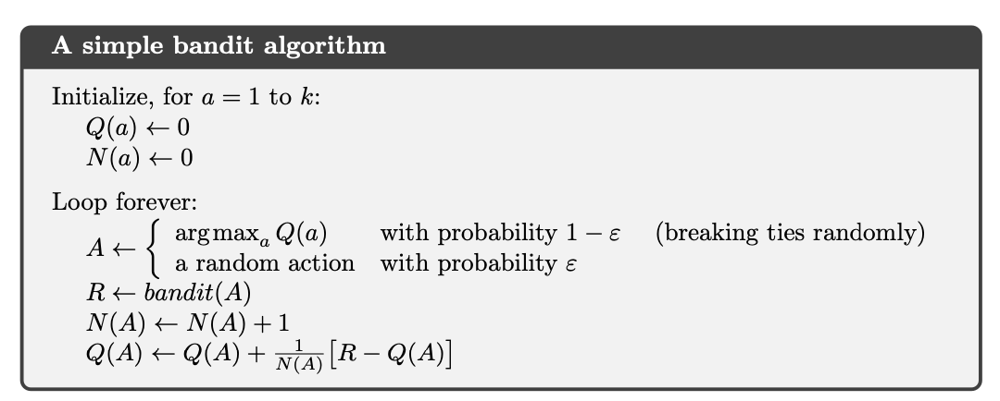

# Multi Armed Bandits

It's a class of problems where you have to choose between multiple options, each with an underlying distribution of rewards. You have to maximize rewards over some time t. So you have to find a balance between explorating the space of options or exploiting the current knowledge.

In the olden days the slot machines at casinos were called one armed bandits, because they had a single lever to pull. The multi armed bandit problem is a generalization of this problem. You have multiple bandits, and some n turns total. Each bandit will give you some reward based on its own distribution. The goal is to maximize the total reward over n turns.

This is one of the basic problems. You assume stationary probability distribution.

$ A_t $ is the action taken at time step t, Corresponding reward is $ R_t $.    

The value of an arbitary action a $ q_*(a) $ is the expected reward given that a is selected.

$$
q_*(a) =  \mathbb{E}[R_t | A_t = a]
$$

We do not know the action values with certainty but we can use the sample mean as an estimate.

This is an unbiased estimate of the true value of action.

The estimated value of action a at time step a is $ Q_t(a) $.
$$
Q_t(a) = \frac{\text{sum of rewards when a taken before t}}{\text{number of times a taken before t}} = \frac{\sum_{i=1}^{t-1} R_i \cdot 1_{A_i = a}}{\sum_{i=1}^{t-1} 1_{A_i = a}}
$$

Where $ 1_{A_i = a} $ is an indicator function that is 1 if $ A_i = a $ and 0 otherwise.

As the denominator goes to infinity, by the law of large numbers, $ Q_t(a) \rightarrow q_*(a) $.

At any time step, the action with the highest estimated value is the **greedy action**. If we were to take the greedy action, we would be **exploiting**, if we choose any other action, we would be **exploring**.

$ A_t = \text{argmax}_a Q_t(a) $ is the greedy action.

## Incremental Implementation

Let $ R_i $ be the reward after $i_{th}$ selection of this action, $ Q_n $ deconte the estimamte of its action value after it has been selected $ n - 1 $ times.

$$
Q_n = \frac{R_1 + \ldots + R_{n-1}}{n-1}
$$

$$
Q_{n+1} = Q_n + \frac{1}{n} [R_n - Q_n]
$$

this implementation requires memory only for the previous reward and the previous estimate.

$ \text{NewEstimate} \leftarrow \text{OldEstimate} + \text{StepSize} [ \text{Target} - \text{OldEstimate} ] $

Target - OldEstimate is the error in the estimate.
StepSize changes from time step to timestep.

StepSize -> $ \alpha $ or $ \alpha_t(a) $.

Pseudocode for a compleet bandit algorithm using incrementally computed sample averages and $ \epsilon $-greedy action selection.

$ \epsilon $ is essentially some combination of exploration and exploitation. If $ \epsilon = 10\% $, then 10% of the iteration we randomply select an action, hence explore, and 90% of the time we select the greedy action, hence exploit.

## Tracking a Nonstationary Problem

For *non stationary problems*, it makes sense to give more weight to recent rewards than to long-past rewards. One way to do this is to use a constant step-size parameter, $ \alpha $.

$ Q_{n+1} \doteq Q_n + \alpha [R_n - Q_n] $

Where $ \alpha \in (0, 1] $.

$$
Q_{n+1} = (1 - \alpha)^n Q_1 + \sum_{i = 1}^{n} \alpha (1 - \alpha)^{n-i} R_i 
$$

This is a weighted average because teh sum of the weights is 1.
Th weight decays exponentially according to the exponent on $ \alpha $.
Accordingly, this is something called an *exponential recency-weighted averagae*.

Sometimes we might want to vary $ \alpha $ every step, we have already seen $ \alpha = \frac{1}{n} $, which just results in the sample-average method. It converges to true value of action by law of large numbers.

A result from stochastic approximation theory gives considtions to assure the series { $ \alpha_n(a) $} converges with probability 1.

$$
\sum_{n=1}^{\infty} \alpha_n(a) = \infty \text{ and } \sum_{n=1}^{\infty} \alpha_n^2(a) < \infty 
$$

Meaning coefficients must be large enough to recover from intiatial conditions random fluctuations, but must be small enough to ensure convergence)

(Question: proof of this?)

## Optimistic initial values

Intial values add bias to the estimate.

We can set initial value estimates high to encourage exploration in the short run. Doesn't really apply to non-stationary problems.

## Upper-Confidence-Bound Action Selection

When we choose to explore in the epsilon-greedy method, we do so uniformly at random. This is not the best way to explore. We can choose to explore in a more directed way.

the *upper-confidence bound* action at t is

$$
A_t \doteq \text{argmax}_a [ Q_t(a) + c \sqrt{\frac{\ln t}{N_t(a)}} ]   
$$

Where $ N_t(a) $ is the number of times action a has been selected prior to time t. The square root term is a measure of the uncertainty or variance in the estimate of $ Q_t(a) $.

The first term is the exploitative term, it being high means that the average reward action a has given till time step t is high. The second term is a measure of entropy, it is the exploratory term. If an action has been selected multiple times till now, the 'entropy' corresponding to that action is low, hence the exploratory factor for is should be low.

(Question: what if you know that you are the last time step? 
Answer: You should choose the action with the highest estimated value. This is the greedy action. Exploration is for increasing better rewards in the future.) 

(Task: Do more reading on this 'entropy' term)

## Gradient Bandit Algorithms

- Numerical preference for each action a, $ H_t(a) \in  \mathbb{R} $.
- Larger preference -> more often taken
- no interpretation in terms of reward
- action probabilities are determined by the *softmax function* (ie Gibbs or Boltzmann distribution)

$$
Pr{A_t = a} = \frac{e^{H_t(a)}}{\sum_{b=1}^{k} e^{H_t(b)}} = \pi_t(a)
$$

- $ \pi_t(a) $ is the probability of selecting action a at time t.

- intially all action preferences are same

# To be continued