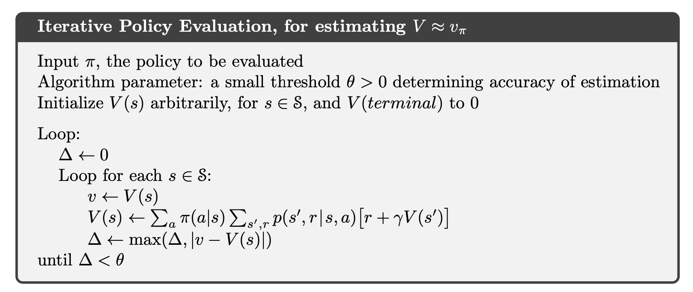

# Chapter 4: Dynamic Programming

- Assume that the MDP is finite, ie the sets of states, actions and rewards are finite.
- The dynamics are given by p(s', r | s, a).
- for tasks with continuous states and actions, quantize state and actions spaces
- DP methosd tend to be computationally expensive, but they are useful for understanding the properties of the optimal value function and policy.

## 4.1 Policy Evaluation (prediction)

- computing state-value function v_pi(s) for an arbirary policy is called policy evaluation. This is the prediction problem

*iterative policy evaluation*

- consider approximate value functions $ v_0, v_1, v_2, ... $ each mapping $ \mathbb{S}^+ \rightarrow \mathbb{R} $.
- initialize $ v_0(s) = 0 $ for all s, this is arbirary, but terminal state should be given 0.
$$
v_{k+1} \doteq \mathbb{E}_{\pi}[\mathbf{R}_{t+1} + \gamma v_k(S_{t+1}) | S_t = s]
= \sum_{a} \pi(a|s) \sum_{s', r} p(s', r | s, a) [r + \gamma v_k(s')]
$$
- as k->inf, $ v_k \rightarrow v_{\pi} $, the value function for policy pi.
- all updates done in dp algos are called *expected updates* because based on expectation over all possible next states, and not some sample next state.
- updates done in  a sweep through the state space

## 4.2 Policy Improvement

Let $ \pi , \pi' $ be deterministic policies such that,
$$
q_\pi(s, \pi'(s)) \ge v_{\pi}(s) \quad \forall s \in \mathbf{S}
$$
Then $ \pi' $ is at least as good as $ \pi $
Also,
$$
v_{\pi'}(s) \ge v_{\pi}(s)  \quad \forall s \in \mathbf{S}
$$

### Greedy Policy Improvement step

The process of making a new policy from the old one, using a greedy strategy with respect to the value function of the old policy is known as Policy Improvement

\[
\pi'(s) \doteq \arg\max_a q_\pi(s, a)  \\ 
= \arg\max_a \mathbb{E}\left[R_{t+1} + \gamma v_\pi(S_{t+1}) \mid S_t = s, A_t = a \right]  \\
= \arg\max_a \sum_{s', r} p(s', r \mid s, a) \left[ r + \gamma v_\pi(s') \right]
\]

Holds for stochastic policies Also

