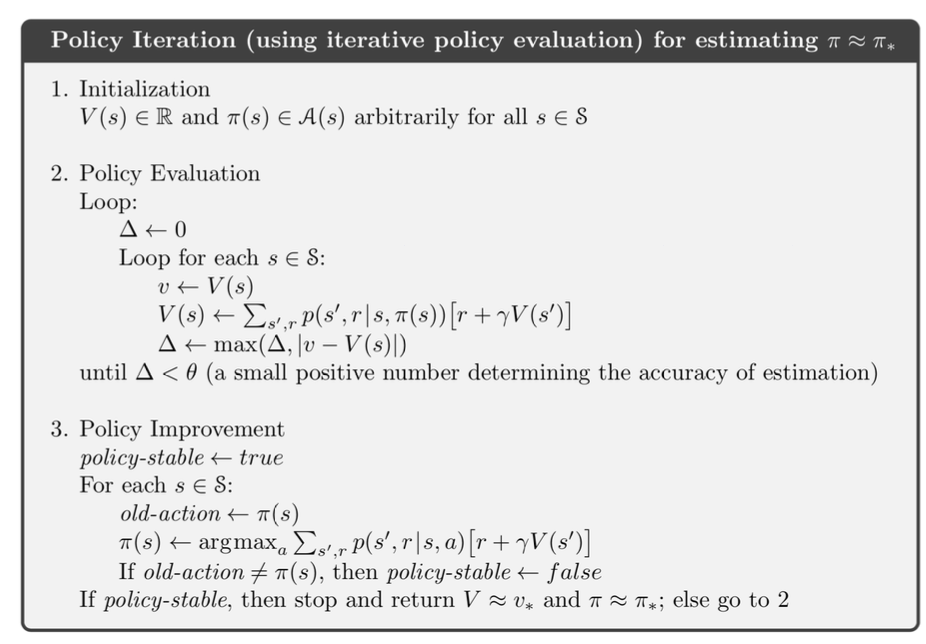
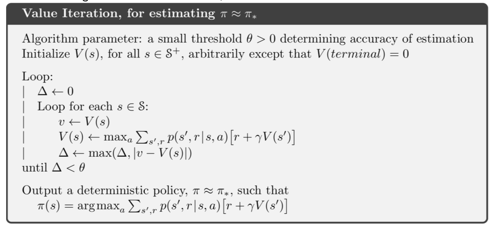

# Chapter 4: Dynamic Programming

- Assume that the MDP is finite, ie the sets of states, actions and rewards are finite.
- The dynamics are given by p(s', r | s, a).
- for tasks with continuous states and actions, quantize state and actions spaces
- DP methosd tend to be computationally expensive, but they are useful for understanding the properties of the optimal value function and policy.

## 4.1 Policy Evaluation (prediction)

- computing state-value function v_pi(s) for an arbirary policy is called policy evaluation. This is the prediction problem

*iterative policy evaluation*

- consider approximate value functions $ v_0, v_1, v_2, ... $ each mapping $ \mathbb{S}^+ \rightarrow \mathbb{R} $.
- initialize $ v_0(s) = 0 $ for all s, this is arbirary, but terminal state should be given 0.
$$
v_{k+1} \doteq \mathbb{E}_{\pi}[\mathbf{R}_{t+1} + \gamma v_k(S_{t+1}) | S_t = s]
= \sum_{a} \pi(a|s) \sum_{s', r} p(s', r | s, a) [r + \gamma v_k(s')]
$$
- as k->inf, $ v_k \rightarrow v_{\pi} $, the value function for policy pi.
- all updates done in dp algos are called *expected updates* because based on expectation over all possible next states, and not some sample next state.
- updates done in  a sweep through the state space

## 4.2 Policy Improvement

Let $ \pi , \pi' $ be deterministic policies such that,
$$
q_\pi(s, \pi'(s)) \ge v_{\pi}(s) \quad \forall s \in \mathbf{S}
$$
Then $ \pi' $ is at least as good as $ \pi $
Also,
$$
v_{\pi'}(s) \ge v_{\pi}(s)  \quad \forall s \in \mathbf{S}
$$

### Greedy Policy Improvement step

The process of making a new policy from the old one, using a greedy strategy with respect to the value function of the old policy is known as Policy Improvement

\[
\pi'(s) \doteq \arg\max_a q_\pi(s, a)  \\ 
= \arg\max_a \mathbb{E}\left[R_{t+1} + \gamma v_\pi(S_{t+1}) \mid S_t = s, A_t = a \right]  \\
= \arg\max_a \sum_{s', r} p(s', r \mid s, a) \left[ r + \gamma v_\pi(s') \right]
\]

Holds for stochastic policies Also

## 4.3 Policy Iteration

1. start with a random policy that assigns some random action for each state
2. Evaluate the policy, that is compute the value function for this policy using Bellman Expectation equation (when no value of v changes by much we stop)
3. policy improvement, for each state pick the best possible action

A finite MDP has only a finite number of policies (as long as they aer deterministic so guaranteed to converge)

## Value Iteration

Policy iteration can be slow

Value iteration - no separate policy evaluation and policy improvement steps.

$$
v_{k+1}(s) \doteq max_a \mathbf{E}[R_{t+1} + \gamma v_{k}(S_{t+1}) | S_t = s, A_t = a] \\
= max_a \sum_{s', r} p(s',r|s,a)[r + \gamma v_k(s')]
$$

for all s $ \in $ S.

That is policy evaluation is stopped after just one sweep(one update of each state).

## 4.5 Asynchronous DP

So far: full sweep of the state space on each iteration
Asynchronous DP algos update the values in place and cover states in any order whatsoever.The values of some states may be updated several times before the values of others are updated once.
To converge correctly, however, an asynchronous algorithm must continue to update the values of
all the states: it can’t ignore any state after some point in the computation.
Asynchronous DPs give a great increase in flexibility, meaning that we can choose the updates we
want to make (even stochastically) based on the interaction of the agent with the environment. This
procedure might not reduce computation time in total if the algorithm is run to convergence, but it
could allow for a better rate of progress for the agent.

## 4.6 GPI Generalized Policy Iteration

We use the term generalized policy iteration (GPI) to refer
to the general idea of letting policy-evaluation and policy-
improvement processes interact, independent of the granularity
and other details of the two processes.

Almost all reinforcement
learning methods are well described as GPI. That is, all have
identifiable policies and value functions, with the policy always
being improved with respect to the value function and the value
function always being driven toward the value function for the
policy.

## 4.7 Efficiency of DP

n states, k actions, technically k^n for any other state space search aglo, but DP -> polynomial in n and k

