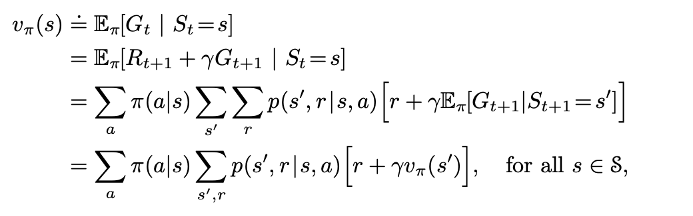
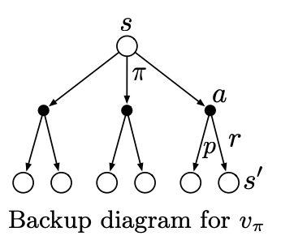
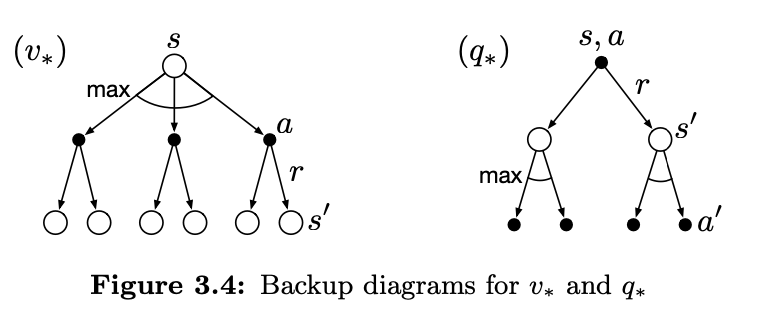

# Ch 3 Finite Markov Decision Processes

## 3.1 The Agent-Environment Interface

The MDP framework says that for learning goal-directed behaviour, only three signals are required.

Action - represent choices made by the agent, this could be as high level or low level, eg for driving a car it could be the movement of a muscle or moving in a direciton

State - the env, the basis on which actions are made, anything that cannot be controlled by the agent is part of the state, eg. the robots body, the dopamine that is released etc, so the state is not about what the agent has knowledge about, but what it can't control

Reward - a single number, defines the goal

Trajectory: a sequence of states, actions and rewards, eg.

$$
s_0, a_0, r_1, s_1, a_1, r_2, s_2, a_2, r_3, s_3, a_3, r_4, s_4, a_4, r_5, s_5
$$

the 'finite' comes from the fact that the three sets of states, actions and rewards are all finite

Markov Property: the state has the *Markov Property*, it captures all the information of the previous state, so to determine the next state and reward, only the current state and action are required

The dynamics of the MDP are the probability of the next state and reward given the current state and Action

$$
p(s', r | s, a) \doteq Pr\{S_t = s', R_t = r | S_{t-1} = s, A_{t-1} = a\}
$$

The function p defines teh dynamics of the MDP

$$
p: S \times R \times S \times A \rightarrow [0, 1]
$$ 

is an ordinary deterministic function of four arguments

$$
\sum_{s' \in S} \sum_{r \in R} p(s', r | s, a) = 1, \forall s \in S, a \in A(s)
$$
$$
p(s'|s, a) = Pr\{S_t = s' | S_{t-1} = s, A_{t-1} = a\} = \sum_{r \in R} p(s', r | s, a)
$$
Expected reward for a state-action pair
$$
r(s, a) \doteq E[R_t | S_{t-1} = s, A_{t-1} = a] = \sum_{r \in R} r \sum_{s' \in S} p(s', r | s, a)
$$
expected rewards for state, action, next state 
$$
r(s, a, s') \doteq E[R_t | S_{t-1} = s, A_{t-1} = a, S_t = s'] = \sum_{r \in R} r \frac{p(s', r | s, a)}{p(s' | s, a)}
$$

example transition graph from example 3.3 , recycling robot

## 3.2 Goals and Rewards

reward signal is to indicate *what* you want to achieve not *how* you want to achieve it.

## 3.3 Returns and Episodes

Episodic tasks: non terminal states $ \mathbf{S} $ , and states including the terminal state $ \mathbf{S^+} $
They come to an end after some finite time steps and the agent-environment interaction is divided into episodes

here we can have $ G_t = R_{t+1} + R_{t+2} + R_{t+3} + ... + R_T $ where T is the final time step

But for continuing tasks

$$
G_t \doteq \sum_{k=0}^{\infty} \gamma^k R_{t+k+1}
$$

for $ \gamma $ = 0, said to be myopic

$$
G_t = R_{t+1} + \gamma G_{t+1}
$$

## 3.4 Unified Notation for Episodic and Continuing tasks

*absorbing state* - termination state, goes to itself with reward 0

$$
G_t \doteq \sum{k=t+1}^{T} \gamma^{k-t-1} R_k
$$

## 3.5 Policies and Value Functions

- The *value function* of a state *s* under a policy $ \pi $ , denoted $ v_{\pi}(s) $ is the expected return when starting in s and following $ \pi $ thereafter

$$
v_{\pi}(s) \doteq E_{\pi}[G_t | S_t = s] = E_{\pi}[\sum_{k=0}^{\infty} \gamma^k R_{t+k+1} | S_t = s] 
$$

- value of the terminal state is always 0
- The function $ v_{\pi} $ is the state-value function for policy $ \pi $

- The value of taking action *a* in state *s* under a policy $ \pi $ is $ q_{\pi}(s, a) $ is the expected return starting from s, taking the action a, and thereafter following policy $ \pi $

$$
q_{\pi}(s, a) \doteq E_{\pi}[G_t | S_t = s, A_t = a] = E_{\pi}[\sum_{k=0}^{\infty} \gamma^k R_{t+k+1} | S_t = s, A_t = a]
$$

- The function $ q_{\pi} $ is the action-value function for policy $ \pi $

- Can estimate these value functions by taking averages of the returns, and the averages per state converge to the value function, and teh average of returns per state-acction converge to the aciton-value function - Monte Carlo methods

- Not practical to keep separate averages for each state, instead agent can maintain them are parameterized functions ( to be seen in chapter 5)

- Bellman equation for $ v_{\pi} $

- each open circle represents a state, and each solid circle represents a state-action pair. Starting from s, agent could take any of some set of actions, based on its policy. Environment could respond with one of several states, along with a reward r based on the dynamics given by the function p.

- we call these backup diagrams because they diagram relationships that form the basis of the update or *backup* operations that are at the ehart of rl methods. These operations transfer value information back to a state from its successor states.

(bunch of examples and exercises here to be done)

## 3.6 Optimal Policies and Optimal Value Functions

- For a finite MDP

$$
\pi \geq \pi' \text{ iff } v_{\pi}(s) \geq v_{\pi'}(s) \quad \forall s \in S
$$

- All the optimal policies are denoted by \( \pi_* \), they share the same state-value function called the *optimal state-value function* denoted by \( v_*(s) \)

$$
v_*(s) \doteq \max_{\pi} v_{\pi}(s) \quad \forall s \in S
$$

- They also share the same *optimal action-value function* \( q_* \)

$$
q_*(s, a) \doteq \max_{\pi} q_{\pi}(s, a) \quad \forall s \in S, a \in A
$$

$$
q_*(s, a) = \mathbf{E}[R_{t+1} + \gamma v_*(S_{t+1}) \mid S_t = s, A_t = a]
$$

- Bellman optimality equation for \( q_* \)

$$
q_*(s, a) = \mathbf{E}[R_{t+1} + \gamma \max_{a'} q_*(S_{t+1}, a') \mid S_t = s, A_t = a]
$$

The Bellman optimality equation forms a system of \( n \) equations with \( n \) unknowns, where \( n \) is the number of states. Given the transition dynamics \( p(s' | s, a) \), these equations can be solved numerically.

Once \( v_*(s) \) is known, an optimal policy can be determined by selecting actions that achieve the maximum value in the Bellman equation:

$$
\pi^*(s) = \arg\max_{a} \sum_{s'} p(s' | s, a) \left[ r(s, a, s') + \gamma v_*(s') \right]
$$

Any policy that is **greedy** with respect to \( v_* \) is optimal. The term "greedy" means selecting actions based only on their immediate effect, but since \( v_* \) accounts for all future rewards, the policy remains optimal in the long-term.

Using \( q_*(s, a) \), action selection becomes even simpler. Instead of computing a one-step lookahead search, an optimal action can be chosen directly:

$$
\pi^*(s) = \arg\max_{a} q_*(s, a)
$$

The function \( q_*(s, a) \) effectively caches the results of all one-step lookaheads, making it unnecessary to know transition dynamics \( p(s' | s, a) \). This is particularly useful in model-free settings where the environment’s dynamics are unknown.

(examples and exercises not done)

## 3.7 Optimality and Approximation

- computing the exact optimal policy using tabular methods is often infeasible in real life applications (eg. in robotics, games, and finance). So we instead approximate it using approximation methods like monte carlo or function approximation.

- There is an advantage of RL here, the online nature of it makes it so that it prioritizes frequently occuring states. Eg the TD-Gammon plays expert level backgammon but does poorly on rare board configuraitons.

