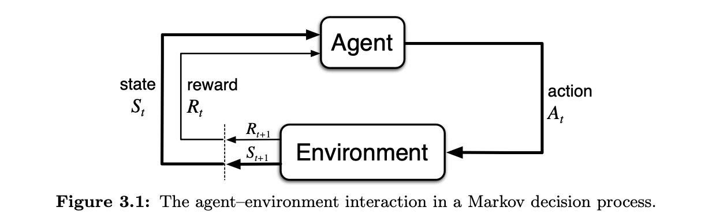
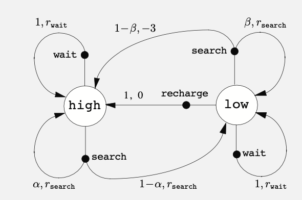

# Ch 3 Finite Markov Decision Processes

## 3.1 The Agent-Environment Interface

The MDP framework says that for learning goal-directed behaviour, only three signals are required.

Action - represent choices made by the agent, this could be as high level or low level, eg for driving a car it could be the movement of a muscle or moving in a direciton

State - the env, the basis on which actions are made, anything that cannot be controlled by the agent is part of the state, eg. the robots body, the dopamine that is released etc, so the state is not about what the agent has knowledge about, but what it can't control

Reward - a single number, defines the goal

Trajectory: a sequence of states, actions and rewards, eg.
$$
s_0, a_0, r_1, s_1, a_1, r_2, s_2, a_2, r_3, s_3, a_3, r_4, s_4, a_4, r_5, s_5
$$

the 'finite' comes from the fact that the three sets of states, actions and rewards are all finite

Markov Property: the state has the *Markov Property*, it captures all the information of the previous state, so to determine the next state and reward, only the current state and action are required

The dynamics of the MDP are the probability of the next state and reward given the current state and Action

$$
p(s', r | s, a) \doteq Pr\{S_t = s', R_t = r | S_{t-1} = s, A_{t-1} = a\}
$$
The function p defines teh dynamics of the MDP
$$
p: S \times R \times S \times A \rightarrow [0, 1]
$$ 
is an ordinary deterministic function of four arguments

$$
\sum_{s' \in S} \sum_{r \in R} p(s', r | s, a) = 1, \forall s \in S, a \in A(s)
$$
$$
p(s'|s, a) = Pr\{S_t = s' | S_{t-1} = s, A_{t-1} = a\} = \sum_{r \in R} p(s', r | s, a)
$$
Expected reward for a state-action pair
$$
r(s, a) \doteq E[R_t | S_{t-1} = s, A_{t-1} = a] = \sum_{r \in R} r \sum_{s' \in S} p(s', r | s, a)
$$
expected rewards for state, action, next state 
$$
r(s, a, s') \doteq E[R_t | S_{t-1} = s, A_{t-1} = a, S_t = s'] = \sum_{r \in R} r \frac{p(s', r | s, a)}{p(s' | s, a)}
$$

example transition graph from example 3.3 , recycling robot

