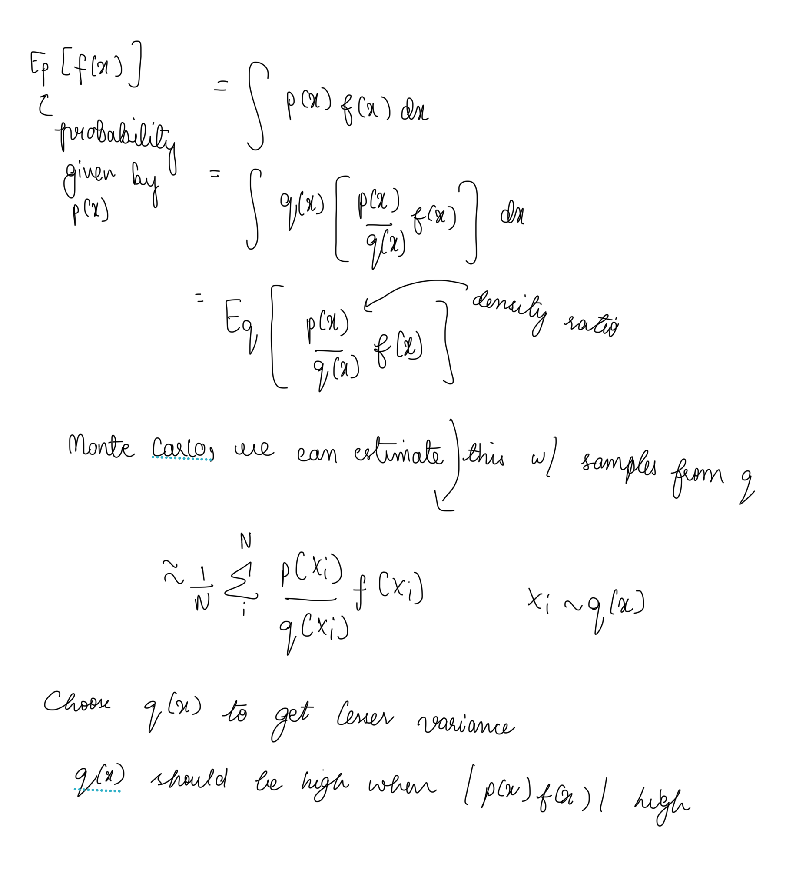

# Monte Carlo Methods

5.1 to 5.4 hand written [here](./5.1To5.4.pdf)

# Intuition/Summary

# Misc notes

"Monte Carlo" refers to the fact that the data is random. Imagine on a surface you have a circle and a square. You randomly drop marbles on the surface, and after a while, the ratio of weight of marbles in the circular/cylindrical surface to that of the square would be pi. This is a "Monte Carlo" way of finding pi.

