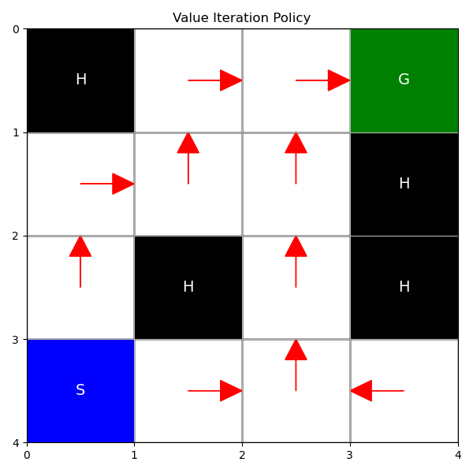

# FrozenLake RL: Policy Iteration vs Value Iteration

Implemented a 4x4 deterministic FrozenLake setting and compared Policy vs Value Iteration.

## Environment
- A 4x4 deterministic FrozenLake grid
- Holes (H) terminate the episode with 0 reward
- Goal (G) gives a reward of 1
- Start (S) is at the top-left corner

```
S . . .
. H . H
. . . H
H . . G
```

### State Numbering (row-major):
```
 0  1  2  3
 4  5  6  7
 8  9 10 11
12 13 14 15
```

### Action Encoding:
- 0 = Left
- 1 = Down
- 2 = Right
- 3 = Up

---

## Algorithms Implemented

### 1. Policy Iteration
- Evaluate current policy until convergence
- Improve the policy greedily using the current value function
- Repeat until policy stabilizes

### 2. Value Iteration
- Iteratively update V(s) using the Bellman optimality equation
- Derive policy greedily from the final value function

---

## Outputs

Both methods converge to the same optimal policy and value function.

### [Policy Iteration]
```
Converged in 7 iterations.
Time taken = 0.000713 seconds.
Policy (reshaper as 4x4 for clarity):
[[1 2 1 0]
 [1 0 1 0]
 [2 1 1 0]
 [0 2 2 0]]
Value function V(s):
[[0.59  0.656 0.729 0.656]
 [0.656 0.    0.81  0.   ]
 [0.729 0.81  0.9   0.   ]
 [0.    0.9   1.    0.   ]]
Success Rate over 1000 trials = 1.00
```

### [Value Iteration]
```
Converged in 7 iterations.
Time taken = 0.000235 seconds.
Policy (reshaped as 4x4 for clarity):
[[1 2 1 0]
 [1 0 1 0]
 [2 1 1 0]
 [0 2 2 0]]
Value function V(s):
[[0.59  0.656 0.729 0.656]
 [0.656 0.    0.81  0.   ]
 [0.729 0.81  0.9   0.   ]
 [0.    0.9   1.    0.   ]]
Success Rate over 1000 trials = 1.00
```

###  Performance
- 100% success rate over 1000 rollouts for both methods
-  **Value Iteration** is typically faster per iteration but may require more iterations
- **Policy Iteration** converges in fewer steps but each step is more computationally expensive
- In this run, both converged in **7 outer loop iterations**, but **Policy Iteration** took longer per iteration

---

## Visualizations

Generated optimal policy arrows over the 4x4 grid:

| Method            | Policy Visualization                          |
|------------------|-----------------------------------------------|
| Policy Iteration |  |
| Value Iteration  |   |

---

##  To Run 

```bash
python main.py
```

---

## 📁 Project Structure
```
.
├── main.py              # Main Python file
├── policy_iteration_policy.png   # Visualization from Policy Iteration
├── value_iteration_policy.png    # Visualization from Value Iteration
└── README.md                     # This file
```
---

## References
- Sutton & Barto
- OpenAI Gym's FrozenLake


# MDP, Policy Iteration, Value Iteration Intuition

Formal description is in my notes [here](../../SBnotes/FMDP.md)

Imagine you are going through a new city you moved into. There are states (locations) you can be in, say at the Museum or the Park, and there are actions you can take in a state, to move to a new state and get some reward. Say you take the metro from the Museum to the Park and receive some happiness +x.

Notice this is a special process: there is some probability of moving to state \( s' \) from a state \( s \) and action \( a \), and **this transition** is not dependent on other history. And there is some reward on taking action \( a \) in state \( s \). The reward I get from hopping on the metro from the Museum is independent of whatever I was doing before.

So I can assign some value to each state, \( v^*(s) \), which is the best long-term reward I can expect from it (this reward calculation would involve some "discounting," wherein instead of adding up all the rewards as I move from this state to another to another, I give higher priority to rewards I receive earlier). I can also assign some value to each state–action pair, \( q(s,a) \). That is: if I am at the museum and I hop on the metro, what is the best long-term reward I can achieve from here? (Get off at the Park and continue on collecting rewards from that state, or get off at the Art Gallery, and continue on your quest?) Or you can have \( V^\pi(s) \): this gives me the long-term reward from my state \( s \), given I do the action dictated by policy \( \pi \).

And I can have a policy that tells me, “Hey, in this state, this action will lead to the best long-term rewards.” Again, at any state, I have some action I should take (deterministic), or perhaps multiple actions with probabilities, but it doesn't matter how I got to this state; this is what makes it "Markov."

Now calculating this \( V \) and policy is not trivial. After all, say there are \( n \) locations I can be in, and suppose the maximum number of actions possible at a state is \( k \). Then technically I have \( k^n \) **(deterministic)** policies possible. Think a tic-tac-toe game: I have \( 3^9 \) states for such a small game (albeit many states are invalid). 

Say I have some policy \(\pi\). It tells me something like: "You are at the Museum, so there is a 50% chance you take the metro, and then (due to the environment's transition probabilities) a 70% chance you end up at stop1, 30% at stop2. And there is 1−50% = 50% chance I take a walk, and say 70% chance I walk to the ice cream shop, and a 30% chance I walk to the mall." (This process is stochastic because it gives me a probability of which action I take from a state—while the next state depends on transition probabilities.)

If my policy just gave me a 100% chance I take one specific action (like "go on the metro"), it would be deterministic. Where I get off after taking the metro would then be determined by the environment’s transition probabilities.

I can calculate the value of each state under this policy using **policy evaluation**. Over multiple iterations—each iteration using the Bellman equation to update \( V(s) \)—this can be shown to converge mathematically.

Now I have evaluated this random policy. How do I improve it? **Policy improvement.** So given a policy, I need to output a new policy that is guaranteed to be a bit better. You do this repeatedly to get the best policy ever.

(As a fact: there is always an optimal deterministic policy for finite MDPs, so it does suffice to iterate over the deterministic policies.)

So just act greedy. Let us say my current policy is to take the metro from the museum (deterministic), and that gives me \( Q(\text{museum}, \text{metro}) = 10\), and I know that \( Q(\text{museum}, \text{bus}) = 20\). I just improve my policy to take the bus from the museum instead of the metro. So you do this for every state we have, making a new policy greedily.

This was **Policy Improvement**.

But the value function is now outdated for the new policy, so we need to do policy evaluation again to update it. We just repeat this over and over until we get to the optimal policy (if your policy doesn't improve after you run this, you have found the optimal policy).

Hence, if you take some random policy, calculate its \( V(s)\), improve it, calculate the new \( V(s)\), improve, and continue, this algorithm is called **Policy Iteration**.

In this algorithm, when we have a policy, it can be quite an effort to calculate the exact value function describing it perfectly. To implement it, you typically do multiple sweeps/iterations—each iteration updating \( V(s) \) for each state—until your value function isn't changing at all or is not improving by much.

What if you just stop after 5 iterations to get some approximate idea of the value function? If my current policy is \(\pi(\text{Museum}) = \text{Metro}\), and in reality \( Q(\text{Museum}, \text{Metro}) = 10\), but I do not “complete” the policy evaluation—so perhaps my estimate is \(Q(\text{Museum}, \text{Metro}) = 8\) (which is technically incorrect)—I might still use that to improve my policy early. This again can be shown to converge over time, though it merges “evaluation” and “improvement” in a more interleaved way.

An extreme case is when you **interleave each single Bellman update with an immediate greedy improvement**. This effectively merges policy evaluation and policy improvement on each update and is called **Value Iteration**.

---